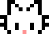
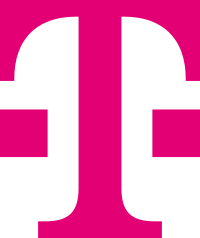

 

Hi, I am

## Flori (they, she, he) 

- 21 years old :birthday:
- Software Engineer (Backend) at Telekom-MMS 
- Studying Computer Science (Bachelor) :mortar_board:

--- 

### How to contact me

**E-Mail:**
[florian@pro-weber.com](mailto:florian@pro-weber.com) (OpenPGP: :white_check_mark:)

**Discord (bleh):** @bitfl0wer

---

---

OpenPGP Fingerprint: `FD3E 9261 DAB4 C2FF 8E92 2EBE 0ACD 574F CF52 26CF`

